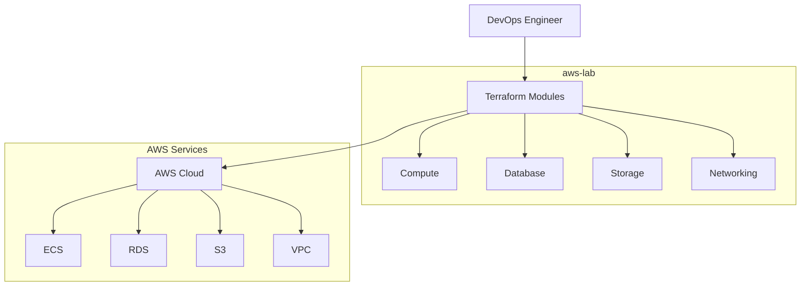
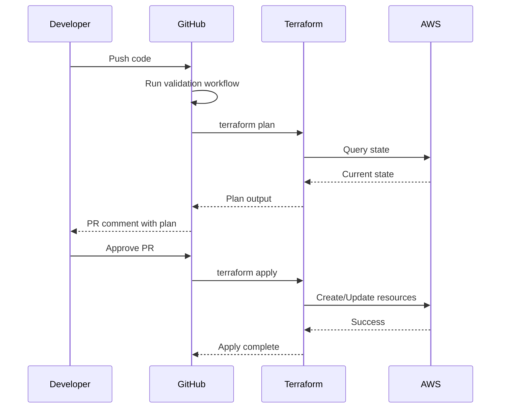
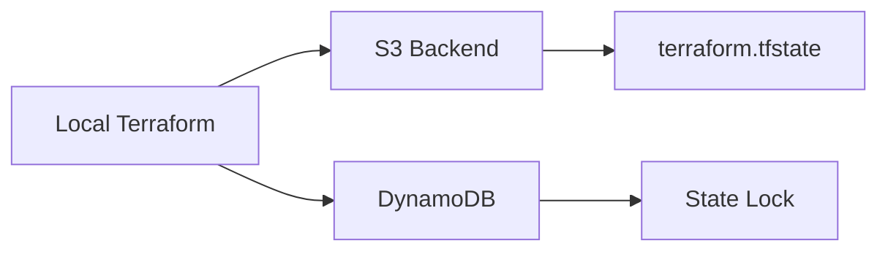
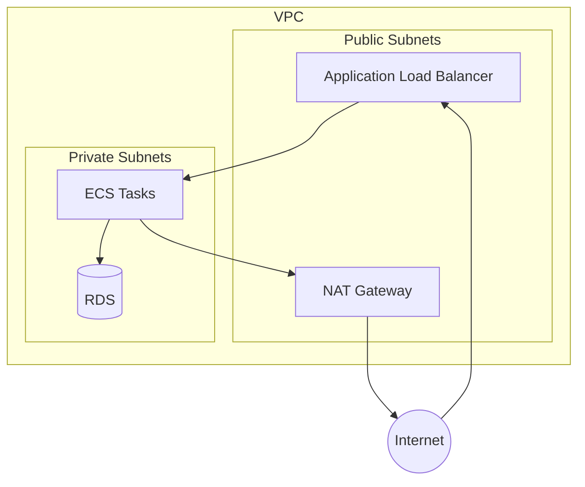
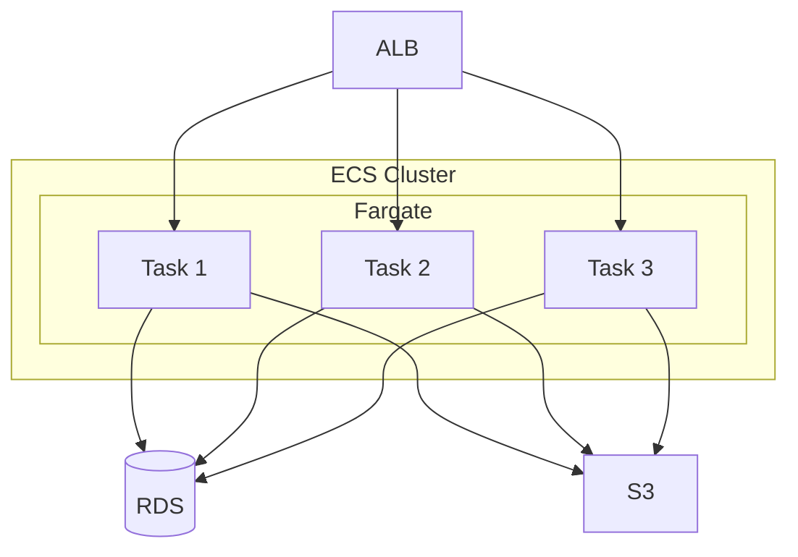

# AWS-Lab Architecture Overview

This document describes the high-level architecture of aws-lab.

## System Context



## Module Architecture

### Core Modules

| Module | Purpose | Location |
|--------|---------|----------|
| **VPC** | Network infrastructure | `shared/vpc/` |
| **ECS** | Container orchestration | `compute/ecs/` |
| **RDS** | Managed databases | `database/rds/` |
| **S3** | Object storage | `storage/s3/` |

### Directory Structure

```
aws-lab/
├── compute/
│   └── ecs/              # ECS clusters and services
│       ├── cluster/      # Cluster module
│       └── service/      # Service module
├── database/
│   └── rds/              # RDS instances
├── storage/
│   └── s3/               # S3 buckets
├── shared/
│   ├── vpc/              # VPC and networking
│   └── iam/              # IAM roles and policies
├── environments/
│   ├── dev/              # Development environment
│   ├── staging/          # Staging environment
│   └── prod/             # Production environment
├── tests/                # Terratest tests
└── examples/             # Example configurations
```

## Module Structure

Each module follows a standard structure:

```
modules/<module-name>/
├── main.tf               # Primary resources
├── variables.tf          # Input variables
├── outputs.tf            # Output values
├── versions.tf           # Provider requirements
├── locals.tf             # Local values
├── data.tf               # Data sources (if needed)
├── iam.tf                # IAM resources (if needed)
├── README.md             # Auto-generated docs
└── doc.md                # Module description
```

## Data Flow

### Deployment Flow



### State Management



## Networking Architecture



## ECS Architecture



## Security Model

### IAM Role Hierarchy

```
Account
├── Terraform Execution Role
│   ├── Can create/modify resources
│   └── Uses OIDC for GitHub Actions
│
├── ECS Task Execution Role
│   ├── Pull container images
│   ├── Write CloudWatch logs
│   └── Read secrets
│
└── ECS Task Role
    ├── Application-specific permissions
    └── Access to S3, DynamoDB, etc.
```

### Network Security

- VPC with public/private subnet separation
- Security groups with least-privilege rules
- NACLs for additional defense
- VPC endpoints for AWS service access

## Environments

| Environment | Purpose | Resources |
|-------------|---------|-----------|
| `dev` | Development | Minimal, single AZ |
| `staging` | Testing | Production-like, smaller |
| `prod` | Production | HA, multi-AZ |

### Environment Configuration

```hcl
# environments/dev/terraform.tfvars
environment = "dev"
instance_count = 1
multi_az = false

# environments/prod/terraform.tfvars
environment = "prod"
instance_count = 3
multi_az = true
```

## Cost Optimization

- Fargate Spot for non-production
- Right-sized instances
- S3 lifecycle policies
- Reserved capacity for production

## Monitoring & Observability

| Component | Tool |
|-----------|------|
| Metrics | CloudWatch Metrics |
| Logs | CloudWatch Logs |
| Traces | X-Ray |
| Dashboards | CloudWatch Dashboards |
| Alerts | CloudWatch Alarms → SNS |

---

*Last updated: 2026-01-31*
